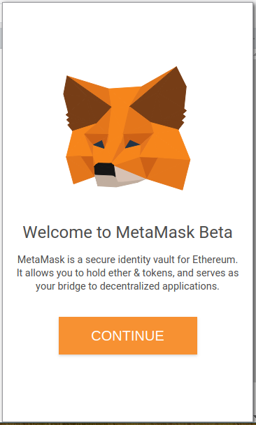
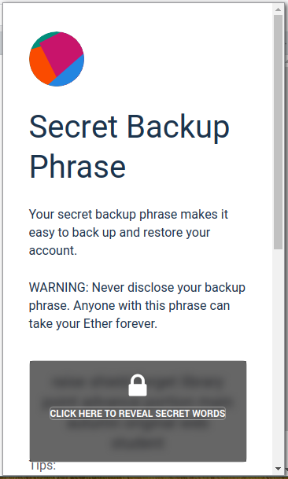
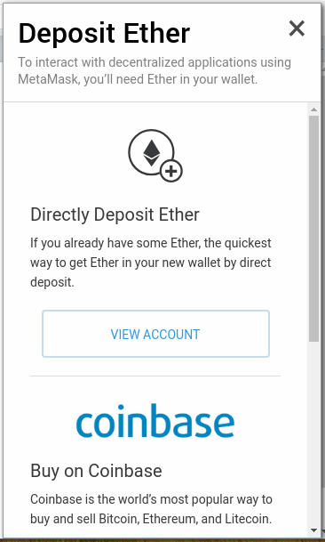
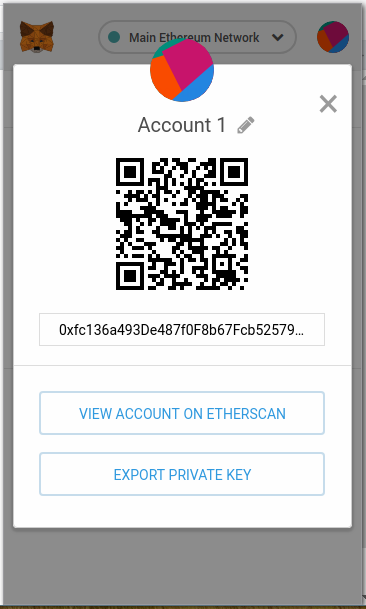
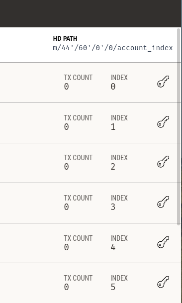
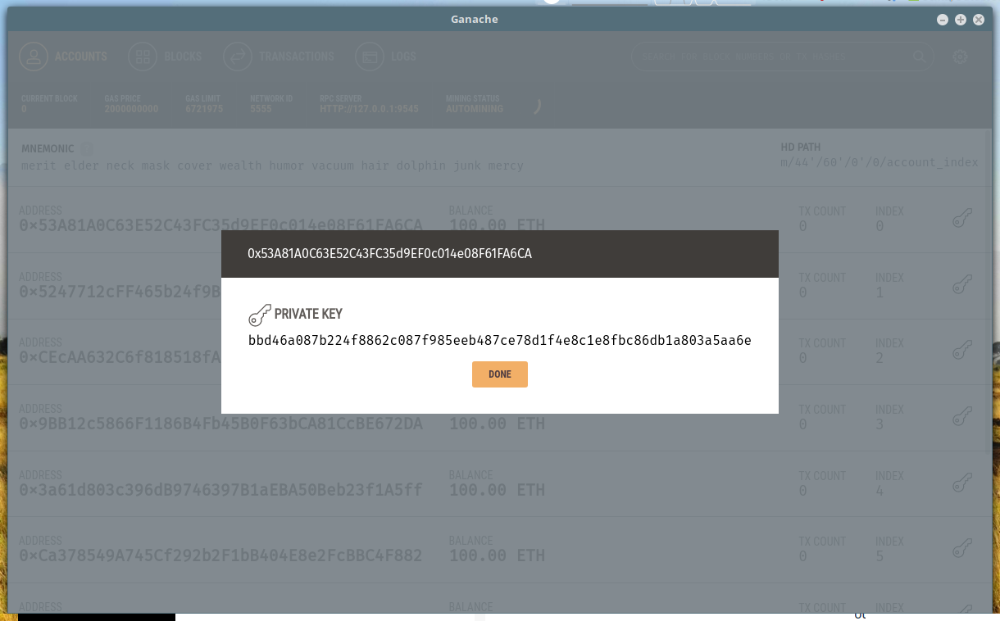
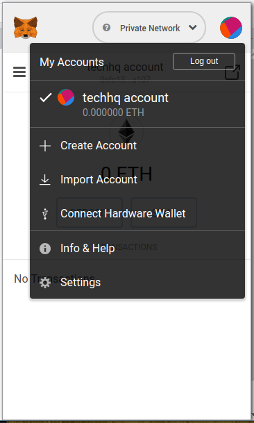
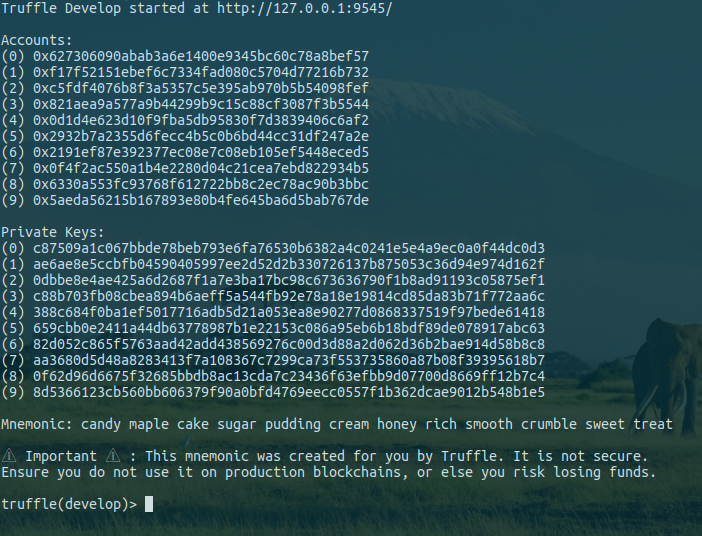

# Manage Metamask
Metamask is an extension that allows a normal browser to connect to ethereum network. Metamask is only available for chrome, firefox and brase browsers.

## Install
Since is only an extension, you should know how to install it on your browser. After install, you will see a new icon on the top right corner with a fox head. Click to start the initial configuration (you only need to do it once).
When you click it, you will see a new window like the following

Click next and it will ask for a password. Write something that you will not forget. If you are not planning to use any real money, write anything. This is the password to the wallet, which you will not be actually using during development. Click next and your account is created. Great. Next again and you will see a window like the following. In this window, you can get the mnemonic to restore your wallet in case you forget the password or want to use this account in other devices. Again, if you are not using real money, this will not something that you will need to worry about, but still, save it, even because in the next step the mnemonic will be asked, so save it, even if it's only to pass the next step.

After this, you will see a window like the following one. This is useful if you already have another account or if you want to deposit some real money. If it's not the case click on "view account".

And there you have, your own account. You can change the name if you want.

## Connect to network
Now, let's consider you have Ganache UI App running, so let's connect to it.
According to image below, click on "main ethereum network" and select "custom rpc". On the "new rpc url" write "http://localhost:9545" and click save. You are connected, go back to the previous window. You are now connected to the private network. Be aware that, at this time, using the account you created, when connected to the private network you have 0 ether, which in the end doesn't let you do anything. So let's import an account from the private network.

## Import account

# From Ganache UI App
Considering you have the ganache app running you should see on the right side that, for each account, there's a key.

Click on the key icon and you should see the revealed key. Copy it.

Now, go back to metamask extension and click on the account icon and select "import account"

Now, paste the key you just copied above and click "import". Now you have your ganache app in your browser, wich means you can do transactions on your private network.

# From truffle command line
Import accounts from the truffle command line is almost the same as import from the ganache ui app. Here the keys are printed on the command line so just copy them and import. The keys correspond the accounts addresses shown above the keys.

# Reset account
When the private network is stopped and reset, the metamask account also needs to be reset. To do so, go click in you account icon, then select "options" and then scroll down until you find "reset account" and do it.

