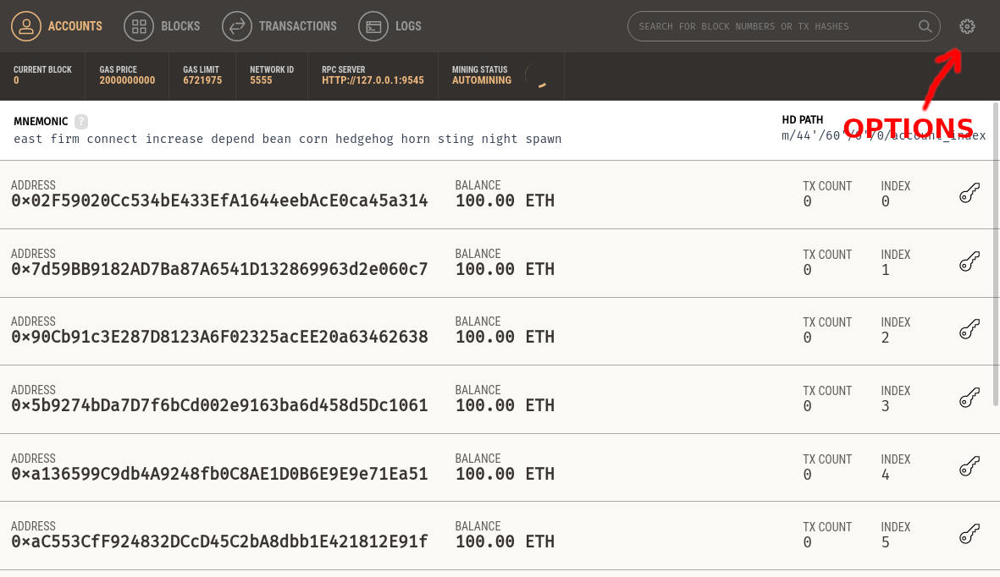
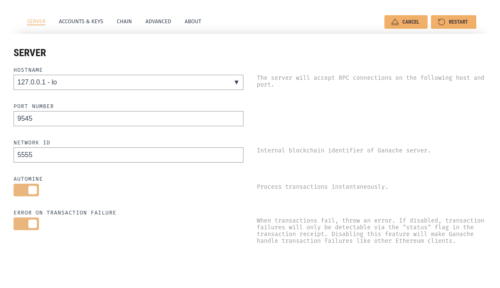

# Manage Ganache UI App
*Quickly fire up a personal Ethereum blockchain which you can use to run tests, execute commands, and inspect state while controlling how the chain operates.*

As simple as this.

## Install
It's not necessary to install anything. Just download the file from the [ganache webpage](https://truffleframework.com/ganache) and run. It's an executable file.

## Change port and other settings
On the main page of ganache app, click "options" (as shown in the image bellow) and change the port number. Then just click "save and restart". There are a ton of other options in "account and keys", "chain" and "advanced".

