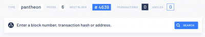

# Pantheon Developer Roadmap
This is a small résumé from a webinar given by consensys. Bellow are cited some parts of the quickstart document they provided to participants.

## Requirements

### Hardware Requirements
  * Pantheon is supported on Mac OS, Linux, and Windows.
  * Your computer should have at least 4 GB RAM.
  * The tutorial runs a small test network that requires minimal disk space (less than 2GB).

### Software Requirements
  * Git or GitHub Desktop
  * Docker and Docker Compose
  * Postman IDE
  * The MetaMask plug-in installed on a supported web browser

### Get docker images
```bash
$ docker pull pegasyseng/pantheon
$ docker pull nginx:alpine
```

## Get the GitHub quickstart repository
In order to make the first approach easier, they provided a quickstart repository, which have a few useful scripts.
`git clone https://github.com/PegaSysEng/pantheon-quickstart.git`

## Test the network
Inside the *pantheon-quickstart* folder (cd pantheon-quickstart) run the command **./run.sh -p 32777**. The option -p is to set a port to the explorer. If this port is not set by parameter, it will be randomly assigned. The moment you start it, you should see the something similar in your command line
```bash
Creating network "pantheonquickstart_default" with the default driver
Creating pantheonquickstart_bootnode_1 ... done
Creating pantheonquickstart_minernode_1 ... done
Creating pantheonquickstart_rpcnode_1   ... done
Creating pantheonquickstart_node_1      ... done
Creating pantheonquickstart_node_2      ... done
Creating pantheonquickstart_node_3      ... done
Creating pantheonquickstart_node_4      ... done
Creating pantheonquickstart_explorer_1  ... done
             Name                           Command               State               Ports            
-------------------------------------------------------------------------------------------------------
pantheonquickstart_bootnode_1    /opt/pantheon/bootnode_sta ...   Up      30303/tcp, 8545/tcp, 8546/tcp
pantheonquickstart_explorer_1    nginx -g daemon off;             Up      0.0.0.0:32777->80/tcp        
pantheonquickstart_minernode_1   /opt/pantheon/node_start.s ...   Up      30303/tcp, 8545/tcp, 8546/tcp
pantheonquickstart_node_1        /opt/pantheon/node_start.s ...   Up      30303/tcp, 8545/tcp, 8546/tcp
pantheonquickstart_node_2        /opt/pantheon/node_start.s ...   Up      30303/tcp, 8545/tcp, 8546/tcp
pantheonquickstart_node_3        /opt/pantheon/node_start.s ...   Up      30303/tcp, 8545/tcp, 8546/tcp
pantheonquickstart_node_4        /opt/pantheon/node_start.s ...   Up      30303/tcp, 8545/tcp, 8546/tcp
pantheonquickstart_rpcnode_1     /opt/pantheon/node_start.s ...   Up      30303/tcp, 8545/tcp, 8546/tcp
****************************************************************
JSON-RPC HTTP service endpoint      : http:*localhost:32777/jsonrpc   *
JSON-RPC WebSocket service endpoint : ws:*localhost:32777/jsonws   *
Web block explorer address          : http:*localhost:32777   *                                                                             
****************************************************************
```

Here you can see that there are a few containers running now. The *miner* is the one mining (and he is mining fast, on purpose), there are four nodes, a bootnode, and *rpc* to connect metamask, for example, and the *explorer*, which is the one we will use first to see some information. Connect to [http://localhost:32777](http://localhost:32777) and you should see something like the image below.



As you can see, you can search by block number, transaction hash or address. Or you can also click on the *best block* number and see some information about the most recent block.

## Interact
As in ethereum, you can use metamask to interact with the network. Let's use the RPC node to connect to the network using metamask. Use the information given above about the URL
```bash
JSON-RPC HTTP service endpoint      : http:*localhost:32777/jsonrpc   *
JSON-RPC WebSocket service endpoint : ws:*localhost:32777/jsonws   *
Web block explorer address          : http:*localhost:32777   *  
```
In this case, we will add a new network with the URL [http://localhost:32777/jsonrpc](http://localhost:32777/jsonrpc). If you don't know how to add networks to metamask, read [how to do it here](manage_metamask#connect_to_network).

Now, let's import an account. Let's use the private key provided during the webinar `0x8F2A55949038A9610F50FB23B5883AF3B4ECB3C3BB792CBCEFBD1542C692BE63`. If you don't know how to import accounts to metamask, see [here](manage_metamask#import_account)

## Deploy an app
Now, if you create a new account and send ether from the imported account to the new one you will generate a transaction, which can be seen by using *localhost:32777/tx/<hash of transaction>*. During the webinar they didn't show any usage of truffle but it's possible to do it.

A quick example would be to use truffle and generate a small repository and then migrate. For example, using `truffle init` and changing the file *truffle-config.js* to something like
```javascript
const HDWallet = require('truffle-hdwallet-provider');
const mnemonic = "0x8F2A55949038A9610F50FB23B5883AF3B4ECB3C3BB792CBCEFBD1542C692BE63";

module.exports = {
  networks: {
    local: {
      provider: () => new HDWallet(mnemonic, `http:*localhost:32777/jsonrpc`),
      network_id: "*",
      gas: 5500000,
      skipDryRun: true
    }
  }
}
```
and then run `truffle migrate`. Do not forget to install the dependency `yarn add truffle-hdwallet-provider`.