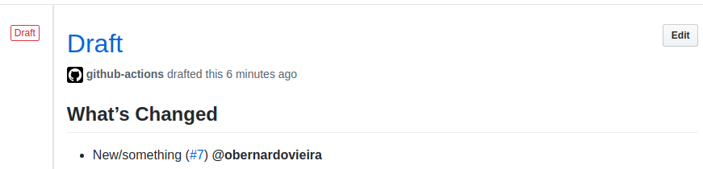
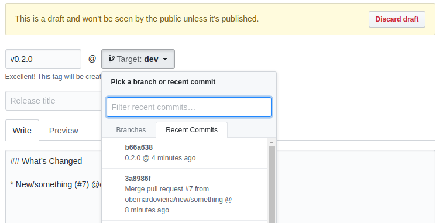

# Packaging

We often publish new versions of the open source projects we have. This tools are provided through npm packages.

If you are looking for how we publish this packages, you are in the right place.

## Setting up package.json

```javascript
{
    "name": "@hq20/package-name",
    "version": "0.0.1-beta",
    "files": [],
    "peerDependencies": {},
    "devDependencies": {}
}
```

Above is an example of a package.json of a project. It should always contains at least the fields shown above. Each one of them has a different purpose.

### name
The project name. In most projects we want to have an org scoped project. To do so we add `@hq20/` before the package name. It is not a rule. When starting a new package it must be decided if we use it or not, and when updating, it should never change.

### version
We follow the [semver](https://semver.org/) standard. Always starting with version **0.0.1-alpha.0**. Read the standard to understand better. The version needs to be changed in every release.

### files
Files or folders to be included in the package. We write typescript almost everywhere, we always have tests and most times also scripts. These are all things that we don't want to include. We compile typescript to javascript and then release the js files (often in a `dist` folder). And we also include the types which we usually don't track on git.

Considering that we want to add `dist` and `types` folders on the package when releasing it, it would look like
```javascript
"files": [
    "dist/",
    "types/"
]
```

### peerDependencies
Read more about `peerDependencies` in npm documentation. We avoid `dependencies` at all cost, if it's a tool to be plugged. The reason why we do that is that, although it looks cool to have a tool that we just install and works out of the box, it isn't cool to install it and have a thousand dependencies also installed with it. Thus, we use `peerDependencies`. `peerDependencies` will require the project to have those dependencies itself. By doing that we avoid circular dependencies and also prevent ou developers to install the same package twice with different versions.

### devDependencies
Dependencies needed to develop the tool. peerDependencies are also here, because peerDependencies does not install anything, it's just a requirement, so we need to include them here.

## Release cycle

The releasing process is simple. Starting with `"version": "0.0.0"` in package.json. When it's ready for the first release, the cycle is really simple. As stated above, we follow the semver standard, therefore, we start prereleases, use patches for small changes, minor for minor changes and major for breaking changes.

To simplify this activity and not fall into mistakes, we use `npm version`. If you are new to this practice, here's an examle of the results, when you apply a given command, having a specific version.

| Current Version        | npm Command           | Next Version  |
| ------------- |:-------------:| -----:|
| 0.0.0      | `npm version prerelease --preid=alpha` | v0.0.1-alpha.0|
| v0.0.1-alpha.0 | `npm version prerelease --preid=alpha` | v0.0.1-alpha.1|
| v0.0.1-alpha.1 | `npm version prerelease --preid=alpha` | v0.0.1-alpha.2|
| v0.0.1-alpha.2 | `npm version prerelease --preid=beta` | v0.0.1-beta.0|
| v0.0.1-beta.0 | `npm version prerelease --preid=beta` | v0.0.1-beta.1|
| v0.0.1-beta.1 | `npm version prerelease --preid=rc` | v0.0.1-rc.0|
| v0.0.1-rc.0 | `npm version patch` | v0.0.1|
| v0.0.1 | `npm version patch` | v0.0.2|
| v0.0.2 | `npm version minor` | v0.1.0|
| v0.1.0 | `npm version minor` | v0.2.0|
| v0.2.0 | `npm version prerelease --preid=alpha` | v0.2.1-alpha.0|
| v0.2.1-alpha.0 | `npm version prerelease --preid=alpha` | v0.2.1-alpha.1|
| v0.2.1-alpha.1 | `npm version patch` | v0.2.1|
| v0.2.1 | `npm version major` | v1.0.0|

So, don't concern yourself choosing the next version. Use `npm version`.

This simplifies the process for you, but does some things underneath. For more information, see [documentation](https://docs.npmjs.com/cli/version).

Once you have everything prepared for a new release, run the following command `git checkout dev && git pull && npm version <the remaining part of your npm version command>`.

This will ensure that, you are on `dev` branch (which we use for development), you have the branch updated, and just then run the `npm version`.

After doing so, push the latest update to the remote repository. At this point, there will be a draft relase in the release section of github's repository, thanks to our release drafter (see [here]() how to setup).



Once you see this (be aware that, the CI might still be running, therefore it is not updated), click in "Edit" and you will see a page similar to the following. The tag name will be different, so first, right the desired tag name. The tag name should be the same as the version in *package.json* file (the result of `npm version` above).



(still to be written about automatic release)


## Test it

It's good to always test our products. We always do it before releasing. But we should do it afterwards as well, just to check that nothing went wrong.

Create a new project, install that dependency you've just published and use it.

### Before the first official release

We test it before releasing, using only the git repository. To do so, create a new project and install the dependency using `github_username/repository_name#branch` (eg. `HQ20/contracts#dev`). This will download the github repository into your project's node_modules, and install its dependencies. Bear in mind that, when doing this, the package name will totally be ignored and instead the folder's name in node_modules will only be the `repository_name`, ignoring the `github_username` as well. Consider the `HQ20/contracts#dev` repository, with a package name of `@hq20/contracts`. When you install is like `yarn add HQ20/contracts#dev`, it will be in node_modules, within a folder named `contracts`.